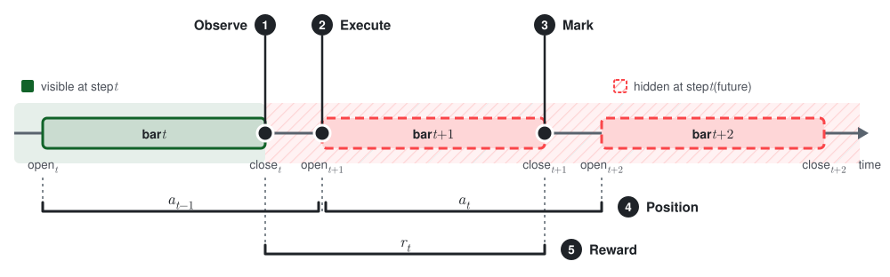
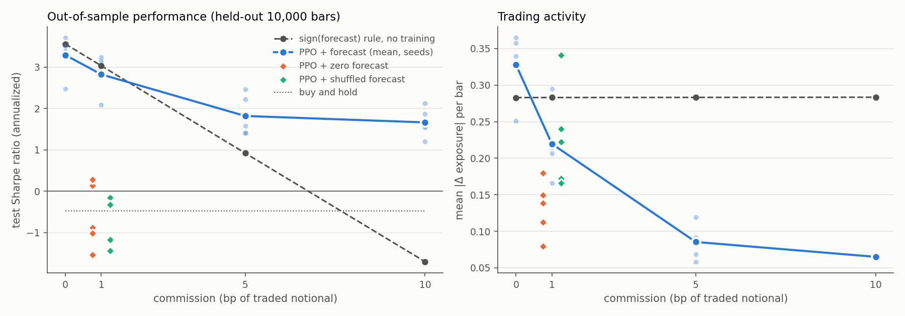
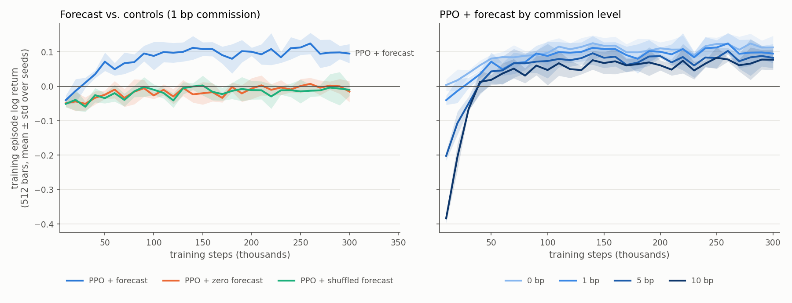

# trading-env

[](https://github.com/hontarea/trading-env-cpp/actions/workflows/ci.yml)
[](LICENSE)

A single-asset trading environment for reinforcement learning. The simulator core is written
in C++20. It is exposed to Python through pybind11 and wrapped as a
[Gymnasium](https://gymnasium.farama.org/) environment, so agents from libraries such as
Stable-Baselines3 can be trained on market data plus extra signals, for example a price
forecast.

This is a course project. The emphasis is on a small simulator whose accounting and step timeline
are explicit and tested, not on breadth of features. A [validation experiment](#validation-experiment)
checks that an agent trained in the environment actually learns to use a forecast, and that it
learns nothing from forecasts that carry no information.

## Features

- **Look-ahead-free step timeline**: the agent observes bar *t*, the order fills at the open of bar
  *t+1*, and the step is marked to the close of bar *t+1*. A unit test proves that changing
  future bars does not change past observations.
- **Exact accounting**: cash, position and equity satisfy `equity = cash + units · price` at
  every step. Shorts are booked symmetrically, and the per-step rewards sum exactly to the
  episode's net log return.
- **Execution costs**: half-spread, linear market impact and commission, all charged in
  currency. Market impact scales with the traded exposure, so costs do not depend on the
  asset's price level.
- **Exposure-based actions**: an action is a target exposure (position value / equity), so
  rewards are scale-free and the same agent works on any asset.
- **Correct episode semantics**: running out of data is `truncated` and comes with a valid
  final observation. Bankruptcy is `terminated`.
- **Configurable observations**: any CSV column can be added to the observation (with an
  optional look-back window). Normalization statistics are fitted on the training range only.
- **Strict data loading**: malformed numbers, duplicate columns and non-increasing
  timestamps raise typed exceptions (`DataLoadError`, `ConfigError`, ...) that are also
  catchable from Python.
- **Tests**: GoogleTest for the C++ core, pytest for the Python layer (including
  Gymnasium's `check_env`), and both run in CI.

## Design

### Step timeline

<picture>
  <source media="(prefers-color-scheme: dark)" srcset="docs/images/step-timeline-dark.svg">
  
</picture>

**Legend**

1. **Observe** (close of bar $`t`$). The agent receives the observation $`o_t`$. The observation
   contains only data from bar $`t`$ and from earlier bars. The agent then selects the action
   $`a_t`$. The action is a target exposure.
2. **Execute** (open of bar $`t+1`$). The environment trades to change the position to the
   target exposure $`a_t`$. The fill price is $`\mathrm{open}_{t+1}`$ plus the spread and the
   market impact. The environment subtracts the commission from the cash.
3. **Mark** (close of bar $`t+1`$). The environment calculates the equity $`E_{t+1}`$ with the
   price $`\mathrm{close}_{t+1}`$. The reward is $`r_t = \log(E_{t+1} / E_t)`$, where $`E_t`$ is the
   equity at $`\mathrm{close}_t`$. Then the agent receives the next observation $`o_{t+1}`$, and
   step $`t+1`$ starts.
4. **Position** (from open to open). The position for the action $`a_t`$ starts at
   $`\mathrm{open}_{t+1}`$. The position stays open until $`\mathrm{open}_{t+2}`$. At
   $`\mathrm{open}_{t+2}`$, the environment changes the position for the next action $`a_{t+1}`$.
   In the same way, the previous position $`a_{t-1}`$ starts at $`\mathrm{open}_t`$ and stops at
   $`\mathrm{open}_{t+1}`$.
5. **Reward** (from close to close). The reward $`r_t`$ starts at $`\mathrm{close}_t`$ and stops
   at $`\mathrm{close}_{t+1}`$. Because of this, the reward period is not the same as the position
   period. The reward $`r_t`$ contains two parts:
   - the previous position $`a_{t-1}`$ from $`\mathrm{close}_t`$ to $`\mathrm{open}_{t+1}`$ (the gap);
   - the new position $`a_t`$ from $`\mathrm{open}_{t+1}`$ to $`\mathrm{close}_{t+1}`$.

   The last part of the position $`a_t`$, from $`\mathrm{close}_{t+1}`$ to $`\mathrm{open}_{t+2}`$,
   goes into the next reward $`r_{t+1}`$.

**Notes**

- **Input data.** Each data column in the observation must be known at the close of its bar.
  For example, the `forecast` value of bar $`t`$ must be available at $`\mathrm{close}_t`$.
- **Sum of the rewards.** The sum of all rewards in an episode is equal to the log return of
  the episode. The split of a position between two rewards does not lose profit or loss. The
  split does not count profit or loss two times.
- **Zero gap.** If a bar opens at the close price of the previous bar, the gap is zero. Then
  $`r_t`$ contains all of the profit or loss of $`a_t`$. The synthetic data in this repository
  has a zero gap.
- **Repeated action.** An action is a target exposure, not a number of units. At each open
  price, the environment changes the position to the target exposure again. Because of this,
  the same action can cause a small trade. Each of these trades costs commission and spread.
  - Example: the agent keeps a short position with $`a = -1`$. The price increases, and the
    exposure goes below $`-1`$. At the next open price, the environment buys back units to
    make the exposure $`-1`$ again.
  - A long position with $`a = 1`$ and leverage 1 needs almost no such trades. Its value
    changes together with the equity.

### Actions and position sizing

`TradingEnv::step(a)` takes a target exposure `a ∈ [-1, 1]`. At the open of bar *t+1* the
position is rebalanced to

```
units = a · max_leverage · equity(open[t+1]) / open[t+1]
```

so `a = 1` is fully long, `a = -1` fully short and `a = 0` flat. Leverage is capped by
construction. The Gymnasium wrapper maps `Discrete(k)` onto configurable levels, by default
`(-1, 0, +1)`.

### Costs

For an order that trades `Δ` units at mid price `m`:

```
fill_price = m · (1 + sign(Δ) · (half_spread + impact_coef · |Δ exposure|))
commission = commission_rate · |Δ| · fill_price          (currency)
```

### Accounting and reward

The portfolio books `cash -= Δ · fill_price + commission` and `units += Δ`, then marks
`equity = cash + units · close[t+1]`. The reward is `log(equity_{t+1} / equity_t)`, so the
sum of rewards equals the net log return of the episode. If equity falls to zero or below,
the episode is `terminated`, and the reward is floored at `log(1e-6)` so it never becomes
NaN.

### Observation

```
[ log_return, mean_log_return_5, <obs_features at t, t-1, …>,   # market part (z-scored)
  exposure, log_equity_growth, episode_frac_remaining ]          # portfolio part
```

`env.observation_names` lists the entries. The market part is z-scored with statistics from
`norm_range`. For an evaluation environment, pass the training range so that no test-set
statistics leak in.

## Installation

You need a C++20 compiler with `std::format` (GCC ≥ 13 or Clang ≥ 17), CMake ≥ 3.20 and
Python ≥ 3.10.

```bash
pip install .                      # builds the C++ extension (scikit-build-core) and the package
pip install ".[test,experiments]"  # + pytest, stable-baselines3, pandas, matplotlib
```

Alternatively, use the provided conda environment: `conda env create -f environment.yml`.

To build and test only the C++ core:

```bash
cmake -B build -Dpybind11_DIR="$(python -m pybind11 --cmakedir)"
cmake --build build -j
ctest --test-dir build --output-on-failure
```

## Usage

```python
import trading_env as te

env = te.TradingGymEnv(
    "data/synthetic_data.csv",        # or te.MarketData.from_columns(timestamps, {...})
    bar_range=(0, 30_000),            # bars that episodes are drawn from
    episode_length=512,               # random start per reset (None = whole range)
    exposure_levels=(-1.0, 0.0, 1.0),
    half_spread=1e-4, commission_rate=5e-4,
    obs_features=["forecast"], obs_lookback=1,
)
obs, info = env.reset(seed=0)
obs, reward, terminated, truncated, info = env.step(2)   # go fully long
print(info)  # fill_price, units_traded, commission, equity, exposure, bankrupt, ...
```

[`examples/train_ppo.py`](examples/train_ppo.py) trains PPO end to end, and
[`examples/smoke_test.cpp`](examples/smoke_test.cpp) uses the C++ API directly. Synthetic data
comes from `python data/generate_data.py --ic 0.05 --seed 0`.

## Validation experiment

The experiment asks whether an agent trained in this environment learns to use a forecast,
and whether it gains nothing from a forecast that carries no information.

**Setup**
- **Data**: 40,000 synthetic hourly bars from `data/generate_data.py`. The forecast has an
  information coefficient of 0.05 (correlation with the next bar's return) and AR(1)
  persistence φ = 0.9. Volatility is 0.5% per bar, and prices follow a random walk.
  - Training range: bars 0–30,000.
  - Held-out test range: bars 30,000–40,000.
- **Agent**: Stable-Baselines3 PPO (`MlpPolicy`) trained for 300k steps on random 512-bar
  episodes.
  - Actions: exposure levels {−1, 0, +1}, max leverage 1.
  - Costs: commission swept over 0 / 1 / 5 / 10 bp; no spread or impact.
- **Arms**:
  - *forecast*: the real forecast.
  - *zero*: the forecast column set to 0.
  - *shuffled*: the forecast column randomly permuted.

  Both controls run at 1 bp. Every arm and cost level runs 5 seeds, 30 runs in total.
- **Baselines (no training)**:
  - the `sign(forecast)` rule: always fully long or short in the forecast's direction
  - buy-and-hold
  - flat




Test-range Sharpe ratios (annualized, mean ± std over 5 seeds):

| policy | 0 bp | 1 bp | 5 bp | 10 bp |
|---|---:|---:|---:|---:|
| PPO + forecast | 3.30 ± 0.47 | 2.83 ± 0.45 | 1.82 ± 0.49 | 1.66 ± 0.35 |
| `sign(forecast)` rule | 3.56 | 3.03 | 0.92 | −1.71 |
| PPO + zero forecast | | −0.60 ± 0.78 | | |
| PPO + shuffled forecast | | −0.69 ± 0.58 | | |
| buy-and-hold | −0.47 | −0.47 | −0.48 | −0.48 |

**Findings**

1. **The agent learns from the forecast.** At 1 bp, PPO with the forecast reaches a Sharpe
   ratio of 2.8 on unseen data. The same agent fed a zero or shuffled forecast ends at or
   below zero, close to buy-and-hold on this test path. This rules out an edge coming from
   the price path itself or from a data leak.
2. **With little or no cost, PPO comes close to the near-optimal rule.** It reaches 3.30
   against 3.56 at 0 bp.
3. **With costs, PPO beats the fixed rule by trading less.** As commission rises from 0 to
   10 bp, the agent's turnover falls fivefold (0.33 → 0.065 mean |Δ exposure| per bar). The
   rule keeps trading at 0.28 and turns negative at 10 bp, while PPO stays at +1.66.

These are synthetic results: one price path, with a known and stationary forecast IC. They
validate the environment and the training pipeline, not a trading strategy.

All metrics, per-run results and resource usage are in
[`experiments/results/summary.md`](experiments/results/summary.md).

**Compute**
- 30 runs at about 100 s each, on one CPU thread per run.
- 5 runs in parallel. The cap came from a pilot job's memory use: about 680 MB peak RSS per
  run.
- About 10 minutes of wall-clock time on a laptop (i7-13700H, 20 threads).

To reproduce:

```bash
pip install ".[experiments]"
python experiments/run_experiments.py    # --workers caps parallelism
python experiments/plot_results.py
```

## Project layout

```text
include/, src/            C++ core: MarketData(+Loader), ExecutionModel, Portfolio, RewardFunctions, TradingEnv
bindings/bindings.cpp     pybind11 module (trading_env._core)
python/trading_env/       Python package and Gymnasium wrapper
tests/cpp/, tests/python/ GoogleTest and pytest suites
examples/                 C++ smoke test and a minimal PPO training script
data/generate_data.py     synthetic bars with a forecast of known IC
experiments/              validation experiment, results and figures
docs/images/              README diagrams
```

## Limitations

- One asset, bar-level simulation: there is no order book, and orders cannot be partially
  filled.
- Orders are always market-on-open, with no limit orders.
- Shorting has no borrow fee and leverage has no financing cost. Equity is the only margin
  check.
- The validation experiment uses synthetic data, where the forecast's predictive power is
  known. It shows that the environment and training pipeline work, not that a strategy is
  profitable on real markets.

## License

[MIT](LICENSE)
